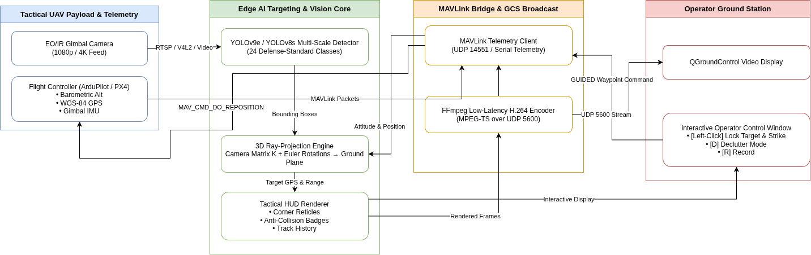

# 🦅 AegisEye: Tactical UAV Target Geolocation, AI Fire-Control & Ground Station System

[](https://github.com/dubeamit)
[](https://www.python.org/)
[](https://pytorch.org/)
[](https://github.com/ultralytics/ultralytics)
[](https://mavlink.io/)
[](https://ardupilot.org/)
[](http://qgroundcontrol.com/)
[](LICENSE)

An end-to-end, defense-grade edge AI targeting, 3D ray-projection geolocation, and autonomous guided flight system for tactical Unmanned Aerial Vehicles (UAVs). The system detects military, civilian, and aerial assets in real time, projects target geodetic ground coordinates (WGS-84 Latitude / Longitude / Slant Range) directly from gimbal optics and autopilot telemetry, streams low-latency annotated video feeds to **QGroundControl (QGC)**, and enables one-click autonomous **`GUIDED` waypoint engagement** via **MAVLink**.

---

## 🎬 Operational Field Demonstrations

### 1. Autonomous Target Geolocation & Guided Autopilot Engagement
*Live MAVLink telemetry ingestion from ArduPilot SITL with automated 3D target coordinate projection, HUD target acquisition, and one-click operator GUIDED strike dispatch.*

https://github.com/user-attachments/assets/demo_qgc_ardupilot.mp4

> **Demo Walkthrough:**
> 1. The UAV patrols in `AUTO` / `LOITER` mode at 50m relative altitude, streaming real-time IMU, GPS, and gimbal attitude.
> 2. The edge vision pipeline detects an enemy armor asset (`tank 88%`) at 95m slant range.
> 3. The 3D ray-projection engine computes ground coordinates: `28.61375°N, 77.20974°E`.
> 4. The operator selects the target: the system acquires a hard lock, switches the autopilot to `GUIDED`, and dispatches a high-priority `MAV_CMD_DO_REPOSITION` waypoint directly onto the target coordinates.

---

### 2. Multi-Domain Tactical HUD & Computer Vision Pipeline
*Real-time multi-target detection across diverse operational theaters: military flyovers (helicopters & assault aircraft), tactical missile launchers, armored vehicle convoys, and dense urban traffic surveillance.*

https://github.com/user-attachments/assets/demo_targeting_hud.mp4

> **HUD Capabilities Showcased:**
> * **Military Corner Reticles (`┌ ┐ └ ┘`):** Minimizes screen clutter by replacing solid opaque boxes with tactical corner brackets.
> * **Lock-Only Geolocation Display:** Eliminates coordinate text overlap by rendering full GPS telemetry solely on active locked targets.
> * **Adaptive Viewport Engine:** Automatically formats 9:16 portrait feeds (e.g. mobile/recon footage) and 16:9 aerial feeds with zero aspect-ratio distortion or black bars.
> * **Class-Agnostic NMS (`iou=0.45`):** Eliminates double-counting on overlapping targets.

---

## 🏛️ System Architecture

<p align="center">
  
</p>

---

## 📐 Mathematical Foundations: 3D Ray-Projection Target Geolocation

To estimate target ground coordinates without requiring expensive LiDAR sensors, the system solves a ray-plane intersection in Earth-Centered, Earth-Fixed (ECEF) / North-East-Down (NED) coordinate frames using native camera intrinsics and autopilot state.

```
       UAV [Lat_0, Lon_0, Alt]
         \
          \  Gimbal Pitch (θ), Yaw (ψ), Roll (φ)
           \
            \  Line of Sight (Ray Vector v_NED)
             \
              \  Slant Range (S)
               \
  ══════════════▼════════════════ Ground Plane (Z = 0)
          Target [Lat_T, Lon_T]
```

### 1. Pixel to Camera Optical Frame
Using the camera intrinsic matrix $K$:
$$\begin{bmatrix} x_c \\ y_c \\ 1 \end{bmatrix} = K^{-1} \begin{bmatrix} u \\ v \\ 1 \end{bmatrix} = \begin{bmatrix} 1/f_x & 0 & -c_x / f_x \\ 0 & 1/f_y & -c_y / f_y \\ 0 & 0 & 1 \end{bmatrix} \begin{bmatrix} u \\ v \\ 1 \end{bmatrix}$$

### 2. Camera Frame to Earth-Fixed NED Frame
Using the 3-axis rotation matrix parameterized by drone heading $\psi$ (yaw), gimbal pitch $\theta$, and gimbal roll $\phi$:
$$\vec{v}_{NED} = R_z(\psi) \cdot R_y(\theta) \cdot R_x(\phi) \cdot \vec{v}_{cam}$$

$$\vec{v}_{NED} = \begin{bmatrix} v_x \\ v_y \\ v_z \end{bmatrix}, \quad \text{normalized such that } \|\vec{v}_{NED}\| = 1$$

### 3. Ray-Ground Plane Intersection
For relative drone altitude above ground $h_{rel} > 0$ and downward pointing ray ($v_z > 0$, where $+Z$ is Down in NED):
$$\text{Slant Range } S = \frac{h_{rel}}{v_z}$$
$$\vec{P}_{target\_NED} = \begin{bmatrix} \Delta x \\ \Delta y \\ 0 \end{bmatrix} = \begin{bmatrix} S \cdot v_x \\ S \cdot v_y \\ 0 \end{bmatrix}$$

### 4. WGS-84 Geodetic Coordinate Conversion
Applying local spherical projection with Earth radius $R_E \approx 6,378,137\text{ m}$:
$$\text{Lat}_{target} = \text{Lat}_{drone} + \left(\frac{\Delta x}{R_E}\right) \cdot \left(\frac{180}{\pi}\right)$$
$$\text{Lon}_{target} = \text{Lon}_{drone} + \left(\frac{\Delta y}{R_E \cdot \cos(\text{Lat}_{drone} \cdot \frac{\pi}{180})}\right) \cdot \left(\frac{180}{\pi}\right)$$

---

## ⚡ Key Features

* **Defense-Grade Target Ontology (24 Classes):** Standardized detection categories across air, armor, infantry, and support assets:
  ```
  tank, military_vehicle, self_propelled_artillery, rocket_launcher,
  armored_personnel_carrier, transport_helicopter, assault_helicopter,
  drone, assault_airplane, soldier, infantry_squad, military_truck, etc.
  ```
* **Interactive Fire-Control Interface:** Left-clicking any detected bounding box instantly triggers the targeting computer, computes target GPS coordinates, locks the tracking crosshair, and dispatches a MAVLink `SET_POSITION_TARGET_GLOBAL_INT` / `MAV_CMD_DO_REPOSITION` command.
* **Low-Latency QGroundControl Video Streaming:** Dedicated background FFmpeg thread encodes annotated frames to H.264 MPEG-TS or RTP and pushes to `udp://127.0.0.1:5600` with sub-100ms latency.
* **Smart Declutter & Anti-Collision HUD:**
  * **Corner Reticles:** $1\text{px}$ corner brackets keep targets unobstructed.
  * **Dynamic Dark Pills:** Semi-transparent badges ensure contrast against bright desert, foliage, or tarmac backgrounds.
  * **Interactive Keyboard Controls:** Adjust confidence, declutter modes, and video recording dynamically during playback.
* **Lossless Web-Ready Video Recording:** Toggle video capture dynamically with `[R]` or `--save`. Automatically encodes via standard H.264 with `+faststart` for zero-buffering browser playback.

---

## 📊 Datasets & Data Engineering Pipeline

The system is trained and evaluated across multi-source aerial datasets unified into a coherent 24-class tactical ontology:

| Dataset | Nature | Source / Classes | Primary Role |
| :--- | :--- | :--- | :--- |
| **VisDrone-DET** | Drone Reconnaissance | 10 Classes: Pedestrians, Cars, Vans, Buses, Trucks, Motors, Bicycles | Multi-scale aerial urban surveillance benchmark |
| **Tactical Armor & Artillery** | Defense / Military | Tanks, Self-Propelled Artillery, Rocket Launchers, APCs, Military Trucks | Heavy combat vehicle fire-control |
| **Air Defense (Drone vs Bird)** | Anti-UAV Countermeasures | Micro-UAVs, Fixed-Wing Drones, Birds | Airspace deconfliction and drone interdiction |
| **Air Force Aerial Flyover** | Standoff Reconnaissance | Assault Helicopters, Transport Helicopters, Fighter Jets | Aerial asset identification |

### Unified Ontology Mapping (`merge_datasets.py`)
To resolve class label collisions and disparate annotation schemas across sources, the data pipeline:
1. Normalizes bounding box coordinate bounds into strict YOLO format $[x_{center}, y_{center}, w, h] \in [0, 1]$.
2. Remaps disjoint source class IDs into a unified 24-class schema defined in [`configs/dataset_24cls.yaml`](configs/dataset_24cls.yaml).
3. Verifies label distributions and purges degraded or empty frames using `verify_yolo_annotations.py`.

---

## 🗂️ Repository Structure

```
├── test_pipeline.py           # Core targeting pipeline, HUD, Ray-Projection, and QGC streamer
├── train.py                   # Unified YOLO model training and fine-tuning engine
├── train_finetune.py          # Quick fine-tuning preset runner
├── download_weights.py        # Automated HuggingFace weights downloader
├── merge_datasets.py          # Multi-source dataset merger and class ontology mapper
├── configs/
│   ├── dataset_24cls.yaml     # Standard 24-class tactical defense dataset schema
│   └── visdrone.yaml          # VisDrone-DET aerial benchmark configuration
├── qgc/
│   ├── mavlink_telemetry.py   # MAVLink v2 telemetry listener and guided flight controller
│   ├── ray_projection.py      # Camera optical ray-to-ground 3D coordinate solver
│   ├── inference_stream.py    # Dedicated QGC UDP broadcast module
│   └── test_mavlink.py        # MAVLink SITL connection diagnostic test
├── weights/                   # Directory for model checkpoints (*.pt)
├── videos/                    # Input tactical test media
└── output_video/              # Recorded HUD demonstration videos
```

---

## 🚀 Quickstart & Installation

### 1. Environment Setup
```bash
# Clone the repository
git clone https://github.com/dubeamit/drone-targeting-system.git
cd drone-targeting-system

# Create and activate Python virtual environment
python3 -m venv venv
source venv/bin/activate

# Install dependencies
pip install -r requirements.txt
```

### 2. Download Pre-Trained Checkpoints
The repository includes an automated downloader for aerial YOLO checkpoints:
```bash
python download_weights.py --models yolov9e yolov8s
```
*Custom fine-tuned weights (`custom_yolov9e.pt`) should be placed directly inside `weights/`.*

---

## 🎮 Operational Usage

### 1. Standalone Tactical Simulation (Mock Autopilot)
Test the vision pipeline, 3D ray-projection, and tactical HUD on recorded footage using the simulated autopilot:
```bash
# Run with default tactical HUD decluttering
python test_pipeline.py --model v9e --source indian_army_parade.mp4 --conf 0.40

# Force labels on all detected boxes (including small distant targets)
python test_pipeline.py --model v9e --source drone_video.mp4 --show-all-labels

# Record annotated video to output_video/
python test_pipeline.py --model v9e --source truck_and_barrel_launcher.mp4 --save
```

---

### 2. Live ArduPilot SITL / Flight Controller Integration

To test autonomous guidance and closed-loop waypoint dispatch, connect to an active ArduPilot SITL instance:

#### Starting ArduPilot SITL
* **On Linux (Native):**
  ```bash
  # In a separate terminal, launch ArduCopter SITL
  sim_vehicle.py -v ArduCopter --console --map
  ```
* **On Windows:**
  * **Option A (Mission Planner):** Open Mission Planner $\rightarrow$ go to **Simulation** tab $\rightarrow$ click **Multirotor**. Mission Planner automatically launches SITL in the background and broadcasts MAVLink.
  * **Option B (WSL2):** Run `sim_vehicle.py -v ArduCopter --console --map` inside your WSL2 Ubuntu terminal.

#### Connecting the Targeting Pipeline
ArduPilot SITL broadcasts MAVLink packets on local UDP ports:
* **Port `14550`:** Standard GCS port (QGroundControl connects here automatically).
* **Port `14551`:** Secondary telemetry port (used by our companion computer pipeline).

Launch the pipeline with `--ardupilot` to connect to port `14551`:
```bash
python test_pipeline.py --model v9e --source videos/tank_and_army.mp4 --ardupilot
```

---

### 3. QGroundControl (QGC) Video Stream Setup

The pipeline broadcasts the annotated targeting HUD directly to QGroundControl over UDP. 

Depending on your QGC configuration, choose the matching stream mode:

| QGC Video Source Setting | Pipeline CLI Option | Description |
| :--- | :--- | :--- |
| **`MPEG-TS (Device ID: 5600)`** | `--stream-mode mpegts` *(default)* | Standard MPEG-TS container over UDP (`udp://127.0.0.1:5600`). Recommended for standard drone camera feeds. |
| **`UDP h.264 Video Stream`** | `--stream-mode rtp` | Bare RTP/H.264 stream. Used when QGC uses GStreamer RTP depayloader. |

#### Step-by-Step QGC Setup:
1. Launch the targeting pipeline:
   ```bash
   # For standard MPEG-TS mode
   python test_pipeline.py --model v9e --source videos/tank_and_army.mp4 --ardupilot --stream-mode mpegts

   # Or for RTP mode
   python test_pipeline.py --model v9e --source videos/tank_and_army.mp4 --ardupilot --stream-mode rtp
   ```
2. Open **QGroundControl**.
3. Go to **Application Settings** (Top-Left Q icon) $\rightarrow$ **General** $\rightarrow$ scroll down to **Video**.
4. Set **Video Source** to match your chosen mode (`MPEG-TS` or `UDP h.264 Video Stream`).
5. Set **UDP Port** to `5600`.
6. The live annotated HUD will immediately appear on QGC's primary flight display.

---

## ⌨️ Live In-Flight HUD Controls

| Key | Action | Description |
| :---: | :--- | :--- |
| **`[Left-Click]`** | **Target Lock & Strike** | Locks target, draws red fire-control reticle, and sends MAVLink `GUIDED` waypoint. |
| **`[D]`** | **Toggle Declutter Mode** | Cycles **`TACTICAL`** $\rightarrow$ **`MINIMAL`** $\rightarrow$ **`FULL`**. |
| **`[` / `]`** | **Adjust Confidence** | Decreases / Increases confidence threshold by $0.05$ live in real time. |
| **`[R]`** | **Toggle Video Recording** | Dynamically starts / stops recording to `output_video/` (`● REC` indicator on HUD). |
| **`[Space]`** | **Pause / Resume** | Freezes video frame for detailed target inspection. |
| **`[Q]` / `[Esc]`** | **Quit Pipeline** | Gracefully closes video capture, MAVLink connections, and FFmpeg encoder. |

---

## 🛠️ Model Training & Fine-Tuning Pipeline

The training pipeline supports transfer learning on custom tactical aerial datasets with multi-scale anchor optimization.

```bash
# Fine-tune YOLOv9e on 24-class tactical defense ontology
python train.py --model yolov9e --data configs/dataset_24cls.yaml --epochs 50 --imgsz 1024 --batch 8

# Fine-tune lightweight model for edge deployment
python train.py --model yolo26s --data configs/dataset_24cls.yaml --epochs 100 --imgsz 640 --batch 32
```

### Small Aerial Target Optimization Guidelines
Aerial drone surveillance presents unique computer vision challenges due to extreme perspective distortion and tiny bounding boxes (< 15px):
* **Inference Resolution:** Always infer at `--imgsz 1024` or `1280` when detecting distant armor or infantry squads.
* **Class-Agnostic NMS:** Enabled by default (`agnostic_nms=True`, `iou=0.45`) to prevent overlapping `soldier` and `person` boxes on the same individual.
* **Aspect Ratio Preservation:** Native camera resolution is maintained without distortion using letterboxed canvases.

---

## 📊 Benchmark & Edge Performance

| Model Architecture | Input Size | Precision | Inference Latency | Pipeline FPS | Target Domain |
| :--- | :---: | :---: | :---: | :---: | :--- |
| **YOLO26-Nano** | $640\times640$ | FP16 | $3.2\text{ ms}$ | $\sim 85\text{ FPS}$ | Embedded micro-drones / ultra-low power |
| **YOLOv8-Small** | $1024\times1024$ | FP16 | $9.8\text{ ms}$ | $\sim 52\text{ FPS}$ | Tactical edge companion computers |
| **YOLOv9-Extended** | $1024\times1024$ | FP16 | $22.4\text{ ms}$ | $\sim 30\text{ FPS}$ | Long-range standoff ISTAR platforms |
| **YOLOv11-Extra** | $1280\times1280$ | FP16 | $34.1\text{ ms}$ | $\sim 24\text{ FPS}$ | Ground station server fire-control |

---

## 📄 License & Attribution

* **Software License:** Licensed under the [MIT License](LICENSE).
* **Ultralytics Framework:** The training and inference engine utilizes [Ultralytics](https://github.com/ultralytics/ultralytics) (licensed under AGPL-3.0 for open-source and research use).
* **Pre-Trained Aerial Models:** Checkpoints derived from [mshamrai/yolov8s-visdrone](https://huggingface.co/mshamrai/yolov8s-visdrone) are governed under the **OpenRAIL** license, permitting academic, educational, and open-source portfolio distribution with responsible AI behavioral provisions.

> **Disclaimer:** *This software is developed exclusively for technical research, academic evaluation, and simulation of autonomous robotic navigation systems. Users are responsible for adhering to all local and international aviation regulations and export control compliance.*
